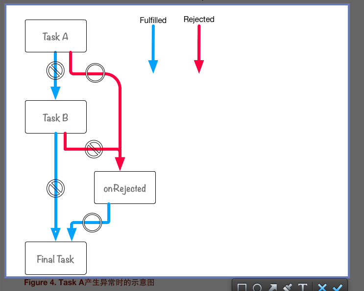

##promise 的相关学习  
[值得参考的书](http://liubin.github.io/promises-book/#__2) 
  
####注意上面的图与下面的代码  
````
  function taskA() {
    console.log("Task A");
    throw new Error("throw Error @ Task A")
  }
  function taskB() {
      console.log("Task B");// 不会被调用
  }
  function onRejected(error) {
      console.log(error);// => "throw Error @ Task A"
  }
  function finalTask() {
      console.log("Final Task");
  }

  var promise = Promise.resolve();
  promise
      .then(taskA)
      .then(taskB)
      .catch(onRejected)
      .then(finalTask);

````  
#### 一定要注意:通过Promise.resolve()方式的时候不要加上new
#### 有两种方式:  
#### A.var promise = Promise.resolve();  
#### B.var promise = new Promise(resolve,reject){}  
（1）[promise chain 学习](https://github.com/AnnVoV/myNodeStudy/blob/ES6/html/promiseStudy.html)  
 (2)[promise chain 中传递参数](https://github.com/AnnVoV/myNodeStudy/blob/ES6/html/promisePassingValue.html)    
 promise 中实现参数的传递，主要是通过return 返回值作为下一个链式的参数传递的  
 (3)[promise Then 返回的是不同对象](https://github.com/AnnVoV/myNodeStudy/blob/ES6/html/promiseThen.html)     
